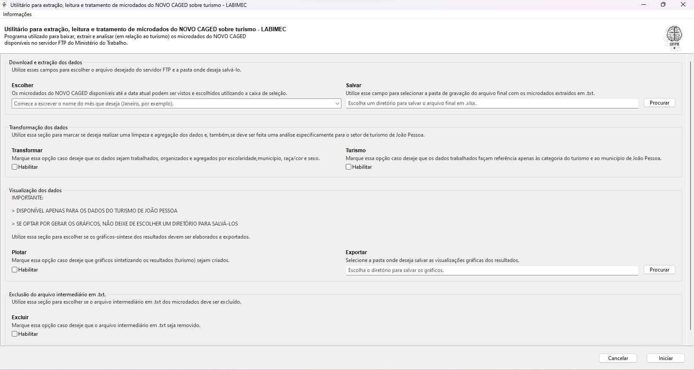
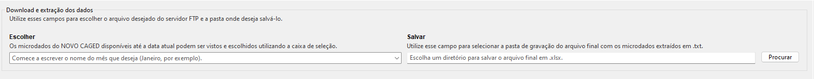
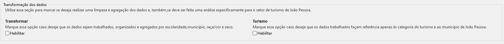
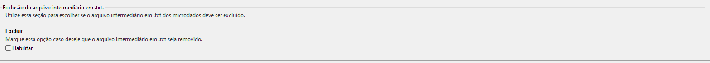

# LABIMEC - NOVO CAGED &nbsp;  &nbsp; &nbsp; &nbsp; &nbsp; &nbsp; &nbsp; &nbsp; &nbsp; &nbsp; &nbsp; &nbsp;  &nbsp;  

Um programa do Laboratório de Inteligência Artificial e Macroeconomia Computacional (LAEC) e desenvolvido por mim, Pedro Milreu Cunha, pesquisador do LABIMEC.

**Descrição e visão geral do programa**

Aplicativo para extração dos microdados do NOVO CAGED (2020-) e análise do setor de turismo em João Pessoa utilizando FTP e Gooey.

----------------------------------------------------------------------------------------------------------------------------------------------------------------

O programa é dividido em quatro seções:
 
 1. **Download e extração dos dados**:
 
  
 
  Utilizar esses campos para escolher o arquivo desejado do servidor FTP e a pasta onde deseja salvá-lo.
   
 2. **Transformação dos dados**:
 
  
 
  Utilizar esses campos para marcar se deseja realizar uma limpeza e agregação dos dados e, também, se deve ser feita uma análise especificamente para o setor de turismo de João Pessoa. 
  
  As **subclasses de ocupações do turismo** são:
  
    - 5510801, 5510802, 5510803,  # Hóteis e similares
    
    - 5590601, 5590602, 5590603, 5590699,  # Outros tipos de alojamento
    
    - 5611201, 5611202, 5611203,  # Restaurantes
    
    - 5612100,  # Serviços ambulantes de alimentação
    
    - 4923001, 4923002,  # Transporte rodoviário de táxi
    
    - 4929901, 4929903, 4929999,  # Transporte rodoviário coletivo
    
    - 4950700,  # Trens turísticos
    
    - 4922101, 4922102, 4922103,  # Transporte rodoviário coletivo (trens)
    
    - 4929902, 4929904,  # Transporte rodoviário coletivo (fretamento) e n.e.a.
    
    - 5011402, 5012202, 5022001, 5022002, 5091201, 5091202, 5099801, 5099899, # Transporte aquaviário
    
    - 5111100, 5112901, 5112999,  # Transporte aéreo
    
    - 7111000,  # Aluguel de transporte
   
    - 7911200, 7912100,  # Agências de viagem
    
    - 7990200,  # Serviços de reserva e n.e.a.
    
    - 9001901, 9001902, 9001903, 9001904, 9001905, 9001999,  # Artês cênicas
    
    - 9102301,  # Atividades de museus
    
    - 9200301, 9200302, 9200399,  # Atividade de exploração de jogos de azar e apostas
    
    - 9319101, 9319199,  # Atividades esportivas n.e.a.
    
    - 9321200,  # Parques de diversão e parques temáticos
    
    - 9329801, 9329802, 9329803, 9329804,9329899 # Atividades de recreação e lazer n.e.a.

e foram agrupadas nas seguintes **categorias**:

    - Alojamento;
    
    - Serviços de alimentação;
    
    - Transporte terrestre;
    
    - Transporte aquaviário;
    
    - Transporte aéreo;
    
    - Aluguel de automóveis;
    
    - Agências e operadoras;
    
    - Atividade culturais;
    
    - Atividades desportivas e recreativas.
  
 3. **Visualização dos dados**:
 
 

 Utilizar essa seção para marcar se os gráficos-síntese dos resultados devem ser elaborados e exportados e escolher a pasta de destino. São eles (todos gráficos de barra):

**************************************************************************************************************************************************************
  1. Salário médio por categoria
  
  2. Salário médio por escolaridade
  
  3. Salário médio por raça/cor
  
  4. Salário médio por sexo
  
  5. Salário médio por categoria, escolaridade e sexo
  
  6. Salário médio por categoria, escolaridade e raça/cor
  
  7. Salário médio por categoria, sexo e raça/cor
  
  8. Saldo de movimentações por categoria
  
  9. Saldo de movimentações por escolaridade
  
  10. Saldo de movimentações por raça/cor
  
  11. Saldo de movimentações por sexo
  
  12. Saldo de movimentações por categoria, escolaridade e sexo
  
  13. Saldo de movimentações por categoria, escolaridade e raça/cor
  
  14. Saldo de movimentações por categoria, sexo e raça/cor
    
**IMPORTANTE: DISPONÍVEL APENAS PARA OS DADOS DO TURISMO DE JOÃO PESSOA**, ou seja, para que essa opção funcione é necessário que se escolha "Sim" na opção de analisar especificamente o turismo em João Pessoa e que se forneça a pasta destino das exportações.

  **************************************************************************************************************************************************************
 
 4. **Exclusão do arquivo intermediario em .txt**:
 
 
 
 Utilizar essa seção para escolher se o arquivo intermediário em .txt dos microdados deve ser excluído.
   
----------------------------------------------------------------------------------------------------------------------------------------------------------------

**Dependências**

Assumindo que o interpretador de Python já esteja instalado em seu computador, utilize o comando `pip install -r requirements.txt` para instalar as dependências necessárias para o funcionamento do programa.

**Organização**

O Laboratório de Inteligência Artificial e Macroeconomia Computacional ([LABIMEC](https://www.ufpb.br/labimec)), da Universidade Federal da Paraíba (UFPB), foi fundado no ano de 2018 e, desde então, vem realizando pesquisas voltadas para a análise de políticas macroeconômicas.

**Contato**

Para sugestões, críticas, elogios ou dúvidas entrar em contato com o desenvolvedor:

_Pedro Milreu Cunha - Doutorando em Economia Aplicada pelo PPGE-UFPB e pesquisador do LABIMEC - [github](https://github.com/PedroMilreuCunha)_
    
através do e-mail pcunha.2107@gmail.com.

  
